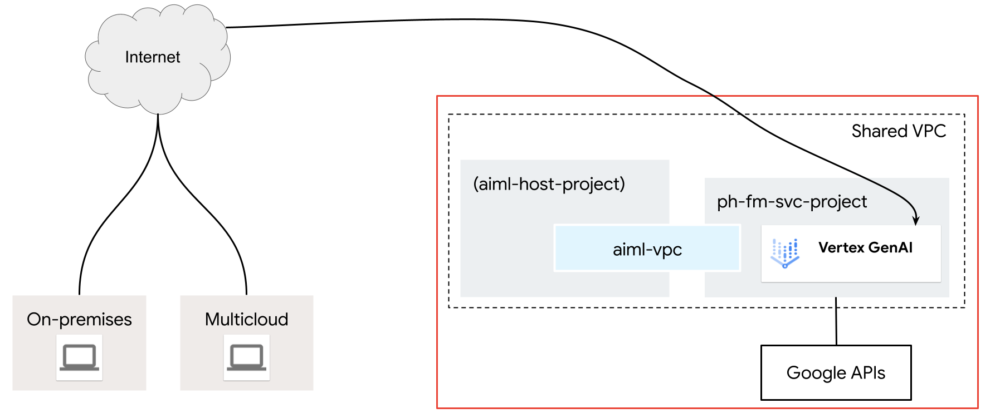

# Overview 
The following terraform example complements the guide provided [here](https://cloud.google.com/vertex-ai/docs/general/vpcsc-public-endpoint) where an admin can restrict calls to vertex ai/gemini via VPC-SC over the internet as shown below.

The python sample included can be found [here](https://cloud.google.com/vertex-ai/generative-ai/docs/start/quickstarts/quickstart-multimodal#send-text-only-request). Please be sure to setup the environment variables for this to run properly. This script can help validate if VPC-SC ingress rules are enforced.